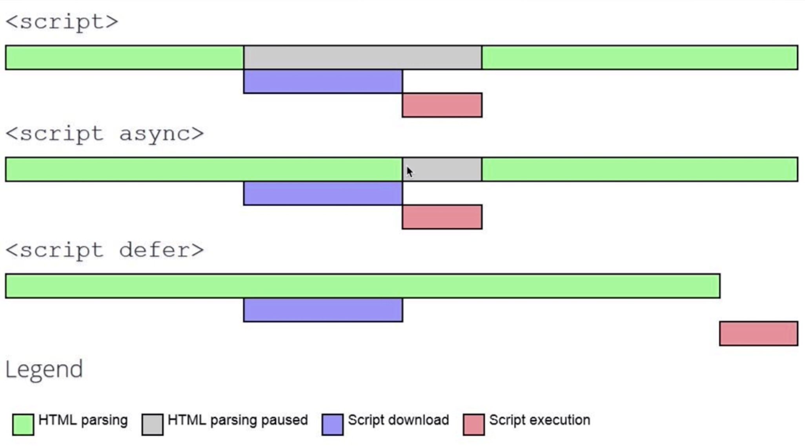

# Web-start
## Essential web files to start a new project:
1. **HTML5**
2. **CSS3**
3. **JAVASCRIPT**

### Adding index.html 
**METATAG** 
> They're at the top of every page in the header and are therefore the first thing seen; stick to the core minimum. Don't add meta tags you don't need — they just take up code space. The less code you have, the better. Think of your page code as a set of step-by-step directions to get somewhere, but for a browser.
>_Kate Morris April 13th, 2017_

These are the meta tags that should be on every page:

- **Meta content type** – This tag is necessary to declare your character set for the page and should be present on every page.
```
<meta http-equiv="Content-Type" content="text/html; charset=utf-8" />

<meta http-equiv="Content-Type" content="text/html; charset=ISO-8859-1">
```
- **Title** – While the title tag doesn’t start with "meta," it is in the header and contains information that's very important to SEO. You should always have a unique title tag on every page that describes the page.

- **Meta description** - The infamous meta description tag is used for one major purpose: to describe the page to searchers as they read through the SERPs. This tag doesn't influence ranking, but it's very important regardless. It's the ad copy that will determine if users click on your result. Keep it within 160 characters, and write it to catch the user's attention. Sell the page — get them to click on the result.

- **Viewport** – In this mobile world, you should be specifying the viewport. If you don’t, you run the risk of having a poor mobile experience — the Google PageSpeed Insights Tool will tell you more about it. The standard tag is:
```
<meta name=viewport content="width=device-width, initial-scale=1">
```

**Extra**
Internet backbone: https://www.submarinecablemap.com/
Maps that explain the Internet: https://www.vox.com/a/internet-maps
First webpage in the world: http://info.cern.ch/hypertext/WWW/TheProject.html
More About the History of the Web: 
- Computer Networks: https://www.youtube.com/watch?reload=9&v=3QhU9jd03a0&list=PL8dPuuaLjXtNlUrzyH5r6jN9ulIgZBpdo&index=29
- Internet: https://www.youtube.com/watch?v=AEaKrq3SpW8&index=30&list=PL8dPuuaLjXtNlUrzyH5r6jN9ulIgZBpdo
- World Wide Web: https://www.youtube.com/watch?v=guvsH5OFizE&index=31&list=PL8dPuuaLjXtNlUrzyH5r6jN9ulIgZBpdo
HTML exercize: https://www.w3schools.com/css/exercise.asp

### Adding style.css 
- **RESET CSS**
One of the pioneers of the CSS Reset method, _Eric Meyer_, created a Reset stylesheet that is still in use on millions of websites today.
**Extra**
CSS SELECTOR exercize: https://flukeout.github.io
CSS QUIZ: https://www.w3schools.com/css/css_quiz.asp

### Adding app.js
- **JavaScript** ("JS" for short) is a full-fledged dynamic programming language that, when applied to an HTML document, can provide dynamic interactivity on websites. It was invented by _Brendan Eich_, co-founder of the Mozilla project, the Mozilla Foundation, and the Mozilla Corporation.

#### **Creating our first js file** 
1. First, go to your test site and create a new folder named 'scripts' (without the quotes). Then, within the new scripts folder you just created, create a new file called app.js 
Save it in your scripts folder.
2. Next, in your index.html file enter the following element on a new line just before the closing </body> tag:
```
<script src="scripts/main.js"></script>
```
This is basically doing the same job as the <link> element for CSS — it applies the JavaScript to the page, so it can have an effect on the HTML (along with the CSS, and anything else on the page).
3. Now add the following code to the main.js file:
```
var myHeading = document.querySelector('h1');
myHeading.textContent = 'Hello world!';
```
4. Finally, make sure the HTML and JavaScript files are saved, then load index.html in the browser.

#### **(What's happened?)**
Your heading text has now been changed to "Hello world!" using JavaScript. You did this by first using a function called querySelector() to grab a reference to your heading, and store it in a variable called myHeading. This is very similar to what we did using CSS selectors. When wanting to do something to an element, you first need to select it.

After that, you set the value of the myHeading variable's textContent property (which represents the content of the heading) to "Hello world!".

### NPM
- NPM is package manager and it was created for developer to share js code that they have written.

In the npm website you can search all the packages that are located in the npm Registry and this registry keeps track of files that have been subitted: they contains two things => js file and package.json file

The packege.json is a metafile that describes this package.
```
npm init -y
```

npm init -> create package.json file

**Nice Modules**
**Nodemon** allows you to see your changes without running node all the time
```
npm install nodemon --save-dev
```
install the nodemon modules in the devDependencies -> only used when we're developing 

- **live-server**
https://www.npmjs.com/package/live-server

- **Lodash**
A modern JavaScript utility library delivering modularity, performance & extras

### GIT
**Tips** 
- How can I delete a file from git repo?
1. Use ```git rm```
```
git rm file1.txt
git commit -m "remove file1.txt"
```
But if you want to remove the file only from the Git repository and not remove it from the filesystem, use:
```
git rm --cached file1.txt
git commit -m "remove file1.txt"
```
And to push changes to remote repo
```
git push origin branch_name  
```
To create a new repo, you'll use the git init command. git init is a one-time command you use during the initial setup of a new repo. Executing this command will create a new .git subdirectory in your current working directory. This will also create a new master branch. 
```
git init
```
After the repository has been initialized, you need to add the origin
```
git remote add origin (link of your central repository on github)
```
We need to pull in order to have the latest version of the master branch
```
git pull origin master
```
If a project has already been set up in a central repository, the clone command is the most common way for users to obtain a local development clone.
```
git clone <repo url>
```

### GIT BRANCHES
Shows all the branches
```
git branch -a
```
Create new branch
```
git branch (branch name)
```
Create new branch (fast way)
```
git checkout -b (branch name)
```
Change branch
```
git checkout (branch name)
```
Delete a branch
```
1. Go back to the master 
2. git branch -D (branch name)
```
Merge the branch when you're happy with the result :)
```
1. Go back to the master 
2. git merge (branch name)
```
**!Important How to fix merge conflict**
1. **Centralized workflow**
Only one master branch everybody working on it
When you've got the error:
__![rejected]   master -> master (fetch first)
error: failed to push some refs to 'git@github.com:// .. ecc'
Updates were rejected because the remote contains work that you do not have locally__
**FIX**
```
git pull --rebase origin master
```
The command ***rebase*** always have the initial commit that came from the central 
repository it will add my commit on top of that workflow 

Then check with: git status to see where is the conflict file is

- To fix the files you can use: 
```
git mergetool 
```
After you've decided how to fix the changes you can continue rebasing

```
git rebase --continue
```
Check if everything is ok -> git push -> git status

To change ONLY the last -m "message" commit 
```
git commit --amend -m "change the message here"
```

2. **Feature Branch Workflow**
Create pull request to discuss with the developers about the new feature

## Git reset 
Reset current HEAD to the specified state;
git reset is a powerful command that is used to undo local changes to the state of a Git repo. Git reset operates on "The Three Trees of Git". These trees are the Commit History ( HEAD ), the Staging Index, and the Working Directory. 

```
--soft
Does not touch the index file or the working tree at all (but resets the head to <commit>, just like all modes do). This leaves all your changed files "Changes to be committed", as git status would put it.

--mixed
Resets the index but not the working tree (i.e., the changed files are preserved but not marked for commit) and reports what has not been updated. This is the default action.

If -N is specified, removed paths are marked as intent-to-add (see git-add[1]).

--hard
Resets the index and working tree. Any changes to tracked files in the working tree since <commit> are discarded.

--merge
Resets the index and updates the files in the working tree that are different between <commit> and HEAD, but keeps those which are different between the index and working tree (i.e. which have changes which have not been added). If a file that is different between <commit> and the index has unstaged changes, reset is aborted.

In other words, --merge does something like a git read-tree -u -m <commit>, but carries forward unmerged index entries.

--keep
Resets index entries and updates files in the working tree that are different between <commit> and HEAD. If a file that is different between <commit> and HEAD has local changes, reset is aborted.

If you want to undo a commit other than the latest on a branch, git-revert[1] is your friend.
```

### Configuration & set up: git config
```
git remote -v
```
You can add as many as you want remote you can call it with any name, it's very useful when you want to test out
the features of a pull request on your computer without compromize the master 

Once you have a remote repo setup, you will need to add a remote repo url to your local git config, and set an upstream branch for your local branches. The git remote command offers such utility.
```
git remote add <remote_name> <remote_repo_url>
```
This command will map remote repository at <remote_repo_url> to a ref in your local repo under <remote_name>. Once you have mapped the remote repo you can push local branches to it.
```
git push -u <remote_name> <local_branch_name>
```
This command will push the local repo branch under <local_branc_name> to the remote repo at <remote_name>.

**How can I test a pull request locally to my computer**
```
git remote add test-feature
```
We're gonna create a new remote called test-feature

We can also check the github repository of the user copy and paste the
username in the browser

## REACT <3
A JavaScript library for building user interfaces

## REDUX 
https://redux.js.org/

### P5.js Library
https://p5js.org/

## JAVASCRIPT ES6 (ECMA SCRIPT VERSION 6)
let - const -> new way to declare a variables
use let when you want to create different scope everytime a let variable is in the {} it creates a new scope
with const you can make sure a variable isn't going to change his value but if it's an object you can still change the 
properties of the object

### **Destructuring**
```
const obj = {
	player: 'bobby',
	experience: 100,
	wizardLevel: false,
}
// Classic old way 
const player = obj.player;

// Distructuring
const { player, experience } = obj;
let { wizardLevel } = obj;
```
### **Object Properties**
```
const name = 'ciao'

const obj = {
	[name]: 'savino',
	[2+1]: 'fa tre',
}
```
If properties and values are the same you can write an object without values see the example 
```
const a = 'name';
const b = true;
const c = {};
// Instead of 
const obj = {
	a: a,
	b: b,
	c: c
}
// We can write directly 
const obj = {
	a,
	b,
	c
}
```
### **Template strings**
```
const name = 'savino';
const age = 28;
const pet = 'dog';
// old way
const greeting = "Hello " + name + "you seem to be" + age;
// template strings
const greetingsbetter = `Hello ${name} you seem to be ${age-10}. What a lovely ${pet} you have!`;
```
### **Default arguments**
```
function greet (name='',age=30,pet='cat'){
	return `Hello ${name} you seem to be ${age-10}. What a lovely ${pet} you have!`;
}
```
### **Symbol**
Compleately unique javascript type
```
let sym1 = Symbol();
let sym2 = Symbol('foo');
let sym3 = Symbol('foo');

sym2 === sym3 //false
```
### **Arrow function**
```
//old way
function add(){
	return a + b
}
// ES6 single return
const add = ( a, b ) =>  a + b 
// ES6 multiple instructions
const add = ( a, b ) =>  {
	let c = 0;
	c = a + b;
	return c
}
```
### **Closures**
A function run the function execute it's never going to execute again 
BUT is going to remember that there are references to those variables
so the child scope always has access to the parent scope

### **Currying**
Currying is the process of converting a function that takes multiple arg into a function that takes one at the time
```
const multiply = (a,b) => a * b;
const curriedMultiply = (a) => (b) => a * b
curriedMultiply(3)(4);

//example if I want a function that multiply everything by 5 
const multBy5 = curriedMultiply(5);
multBy5(5) //25
multBy5(10) //50
```
### **Compose**
```
const compose = (f,g) => (a) => f(g(a));
const sum = (num) => num + 1;
compose(sum,sum)(5) // 7
```
**Avoid side effects, functional purity**
Whatever we put in the parameters 

## NODE JS
Node it's a javascript runtime bulid on Chrome's V8 Javascript Engine 

WHAT THE HELL IS A RUNTIME?
Unlike C and other compiled languages, Javascript runs in a container - a program that reads your js codes and runs them. This program must do two things

- parse your code and convert it to runnable commands //Engine
- **provide some objects to javascript so that it can interact with the outside world.**
The first part is called Engine and the second is **Runtime**

For example, the Chrome Browser and node.js use the same Engine - V8, but their Runtimes are different: in Chrome you have the window, DOM objects etc, while node gives you require, Buffers and processes.

console.log(__dirname) -> full path
- How to import files using the common js
1. const (whatever you want export) = require('file path') 
2. module.exports = { export: export }
- How to use it?
```
const a = (whatever you want export).export;
```

Three kinds of modules that you can have in Node:
- Custom modules (see up ^)
- Build in modules -> 'fs' file system modules allows you to read text file ecc. 
```
const c = require('fs').readFile;
console.log(c);
```
- Build in modules -> 'http' 
- Build in modules -> 'nodemon' (See up ^ for the installation with npm)

## VIM TIPS
Hit the Esc key to enter "Normal mode". Then you can type : to enter "Command-line mode". A colon (:) will appear at the bottom of the screen and you can type in one of the following commands. To execute a command, press the Enter key.
```
:q to quit (short for :quit)
:q! to quit without saving (short for :quit!)
:wq to write and quit
:wq! to write and quit even if file has only read permission (if file does not have write permission: force write)
:x to write and quit (similar to :wq, but only write if there are changes)
:exit to write and exit (same as :x)
:qa to quit all (short for :quitall)
:cq to quit without saving and make Vim return non-zero error (i.e. exit with error)
You can also exit Vim directly from "Command mode" by typing ZZ to save and quit (same as :x) or ZQ to just quit (same as :q!). (Note that case is important here. ZZ and zz do not mean the same thing.)
```

## DATABASES 
### **What is a database?**
- (Wikipedia) A database is an organized collection of data, stored and accessed electronically. Database designers typically organize the data to model aspects of reality in a way that supports processes requiring information, such as (for example) modeling the availability of rooms in hotels in a way that supports finding a hotel with vacancies.

- (Techopedia) A database (DB), in the most general sense, is an organized collection of data. More specifically, a database is an electronic system that allows data to be easily accessed, manipulated and updated.

### **POSTGRES**
PostgreSQL is a powerful, open source object-relational database system that uses and extends the SQL language combined with many features that safely store and scale the most complicated data workloads.

When install postgres make sure you intall only the .app 

List of common useful command:
```
createdb namedb; //create new database
\c namedb; // connect to the database 
create table tableName (id serial primary key, name text, email text, password text); // create new table with values in it
insert into tableName (keys) values (val); // insert values into the table 
\l // show list of the databases
\dt+ // show list of tables
\d tableName // describe table tableName
select * from tableName; // Retrieves information from a table
select * from tableName where name = 'savino'; // optionally given conditions 
select count(*) from tableName; // return the number of values into the tableName
delete from tableName where name = 'savino'; // delete data from table that meet given conditions
alter table tableName add column price integer; // how to modify a table 
alter table tableName drop column user_id; // modify and delete table 
update tableName set column1 = value1, column2 = value2 where condition; // update values 
select * from tableName where user_id = (select (id) from users where email = 'savino'); // chaining queries
select * from tableName order by id asc; // order elements in ascendant order or use desc for descendant order 
user_id integer references tableName // how to assign foreign key 
```
we can always use **default now()** to print out the date automatically;

ORM -> (Object relational mapping) way to comunicate to the database kepping using the back-end language 

### **SQL FUNCIONS**
- Average
```
select avg(column) from tableName;
```
- Sum 
```
select sum(column) from tableName;
```
- Count (accumulator)
```
select count(column) from tableName;
```

### Join table
In order to select the information that you need we can join table
```
select * from tableName join targetTableName on tableName.property = targetTableName.property
```

### Delete
```
delete from tableName where name='Sally';
```

## **SEQUELIZE**

table that rapresenting something in the real world like table hats -> hats is the MODEL

the sequelize.sync() -> create the tables 
with the .then we're inserting values 

## **SSH**
ssh-keygen  command:
```
ssh-keygen -t rsa -b 4096 -C "your_email@example.com"
pbcopy < ~/.ssh/id_rsa
ssh-add ~/.ssh/id_rsa
```
Tip:
```
ssh-add -l //list of all the identities
ssh-add -D //remove all the identities 
```

## **Performance**
### **Critical Render Path**

DOM => CSSOM => RENDER TREE => LAYOUT => PAINT

Improve: 
front-end
transfer of the file (network latency)
back-end processing 

1. Network transfer section
Minimize the size of the files

JS => https://www.uglifyjs.net/

IMAGES => 
- transparency: PNG
- animations: GIF
- colorful images: JPG
- simple icons: SVG
- Reduce PNG -> TinyPNG (works also for the JPG)
- Reduce JPG -> jpeg-optimizer
- Try to choose simple illustrations over highly detailed photographs
- Always lower jpg image quality (30-60%)
- Resize image based on size it will be displayed 
- Display different size image for different backgrounds 
- Use CDNs like imigix
- Remove image metadata

To do list:
- Minimize all text
- Minimize images
- Media Queries
- Minimize number of file 

Always load the style as soon as possible and putting the js file at the bottom (remember js is blocking the download of the other files es css);

### **HTML:**
- Load style tag in the <head>
- Load script right before </body>

### **CSS:**
- Only load whatever is needed 
- Above the fold loading (only load the content that the user is able to see) 

Using a script we can load after the content above the fold is DOM content loaded:
```
<script type="text/javascript">
	const loadStyleSheet = src => {
		if(document.createStylesheet){
			document.createStylesheet(src)
		} else {
			const stylesheet = document.createElement('link');
			stylesheet.href = src;
			stylesheet.type = 'text/css';
			stylesheet.rel = 'stylesheet';
			document.getElementsByTagName('head')[0].appenChild(stylesheet);
		}
	}

	window.onload = function() {
		console.log('window done!');
		loadStyleSheet('./style2.css');
	}
</script>
```
Adding this piece of code into your html file you don't need to add the style with the link tag.

- Media attributes 

We can also load specific style for specific media queries(screen size)
```
<link rel="stylesheet" type="text/css" href="./style2.css" media="only screen and (min-width:500px)">
```

- Less specificity

Example 
```
/* bad */
.header .nav .item .link a.important {
	color: red;
}

/* good */
a.important {
	color: red;	
}
```

**Tips:**
Remember: CSS is render blocking;
We should in terms of performace write css inline (that means less request)

### **JS**
- Load scripts asynchronously
```
<script src="demo_async.js" async></script>
```
- Defer loading of scripts
```
<script defer src="script.js"></script>
```


IF the core functionality requires js => use async 
IF the core functionality doesn't require js => js should be deferred outside of the critical render path  

- Minimize DOM manipulation
- Avoid long running Javascript

Javasript it's usually called **parser blocking**;

**Performance Resources**
- https://developers.google.com/speed/pagespeed/insights/

